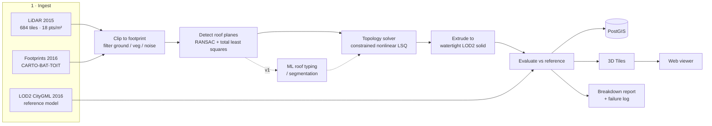

# mtl-roofs

[](https://github.com/grigorybaluev/mtl-roofs/actions/workflows/ci.yml)
[](https://github.com/grigorybaluev/mtl-roofs/actions/workflows/eval-smoke.yml)
[](https://codecov.io/gh/grigorybaluev/mtl-roofs)
[](https://github.com/grigorybaluev/mtl-roofs/releases)
[](LICENSE)

**Reconstructs LOD2 building roofs for Montréal from open aerial LiDAR and building
footprints, and evaluates every building against the city's own 3D building model.**

Most roof-reconstruction demos stop at a picture. This one is built around the
measurement: Montréal publishes both a 2015 aerial LiDAR survey *and* a 2016 LOD2
CityGML model of the same buildings, so every reconstructed roof can be scored
against an independent reference — vertical RMSE, plane-orientation error, topology
agreement and coverage, broken down by roof type, building size and point density,
with a per-building failure log rather than a cherry-picked gallery.

> 🖼️ **Live viewer:** _coming with v0.1.0_ → https://grigorybaluev.github.io/mtl-roofs/
>
> _(placeholder: viewer GIF showing points → reconstruction → reference → error colouring)_

## Results

Headline numbers on the v0 study area (**CDN–NDG tile 03**, 1,109 buildings).

| Metric | Classical | ML (v1) | Notes |
|---|---:|---:|---|
| Vertical RMSE (m) | _pending v0_ | — | on a common 0.5 m grid |
| Plane orientation error, median (°) | _pending v0_ | — | matched planes only |
| Face-count agreement | _pending v0_ | — | symmetric, in [0, 1] |
| Footprint coverage | _pending v0_ | — | reconstructed / reference roof area |
| Buildings reconstructed | _pending v0_ | — | of 1,109 |

The reference model is **2016** and the LiDAR is **November–December 2015**. Buildings
altered in that window produce real errors that are not reconstruction errors; results
are reported both raw and with those buildings flagged. See
[`docs/evaluation.md`](docs/evaluation.md).

## Pipeline



## Quickstart

Needs [pixi](https://pixi.sh) and Docker. No Homebrew, and no local PostgreSQL —
see [`CLAUDE.md`](CLAUDE.md) for why.

```bash
git clone https://github.com/grigorybaluev/mtl-roofs && cd mtl-roofs
cp .env.example .env

pixi install                 # conda-forge: PDAL, GDAL, PROJ, GEOS, the lot
pixi run test                # unit tests
pixi run db-up               # PostGIS in Docker, waits for healthcheck

pixi run mtl-roofs data areas                  # study areas
pixi run mtl-roofs data plan   -a cdn-ndg-03   # what would be downloaded, and what is pinned
pixi run mtl-roofs data fetch  -a cdn-ndg-03   # ~1.07 GB, verified against the manifest
pixi run mtl-roofs data verify -a cdn-ndg-03   # re-check what is on disk, offline
```

Every artefact is checked against a SHA-256 pinned in `data/manifest.yaml`. An existing
file that fails verification is re-downloaded once; if it still fails, the command exits
non-zero rather than letting a corrupt tile into the pipeline.

`data fetch` does **not** download the city's 20 GB archives. It reads their ZIP64
central directories over HTTP range requests and streams only the tiles the study
area needs — about 190 MB per km². The per-tile URLs the city advertises are all
dead, so this is the only working route to a single tile.

### Tasks

| Task | What it does |
|---|---|
| `pixi run lint` / `format` | ruff check / ruff format + autofix |
| `pixi run typecheck` | `mypy --strict src` |
| `pixi run test` | unit tests with coverage |
| `pixi run test-integration` | needs `db-up` |
| `pixi run eval-smoke` | metrics on `tests/fixtures/`, the regression guard |
| `pixi run db-up` / `db-down` | PostGIS container |
| `pixi run -e viewer viewer-dev` / `viewer-build` | Vite dev server / production build |

## Data and attribution

All three datasets are published by the **Ville de Montréal** under
[CC BY 4.0](https://creativecommons.org/licenses/by/4.0/):

> Contains information licensed under CC BY 4.0 from the Ville de Montréal
> (LiDAR aérien 2015; Bâtiments 3D 2016 — Maquette LOD2; Bâtiments 2D 2016).
> Portions of the 2D building layer derive from 2007 aerial photography
> © Communauté métropolitaine de Montréal.

Everything is processed in **EPSG:2950** (NAD83(CSRS) / MTM zone 8), metres,
**CGVD28** elevations. Coverage, licences, file sizes, checksums, and the pitfalls
found while verifying them are in [`docs/data-sources.md`](docs/data-sources.md).

**No data is committed to this repository.** `data/` is git-ignored; the only
exception is `tests/fixtures/`, which holds a handful of tiny building clips.

## Scope

- **v0 — "one neighbourhood, honest numbers":** one neighbourhood, classical pipeline
  only, full evaluation report, viewer deployed.
- **v1 — "ML + borough scale":** ML roof typing with ablations against the classical
  pipeline on identical metrics, scaled to a full borough.

[Roadmap](docs/roadmap.md) · [Milestones](https://github.com/grigorybaluev/mtl-roofs/milestones) ·
[Architecture decisions](docs/adr/) · [Contributing](CONTRIBUTING.md)
